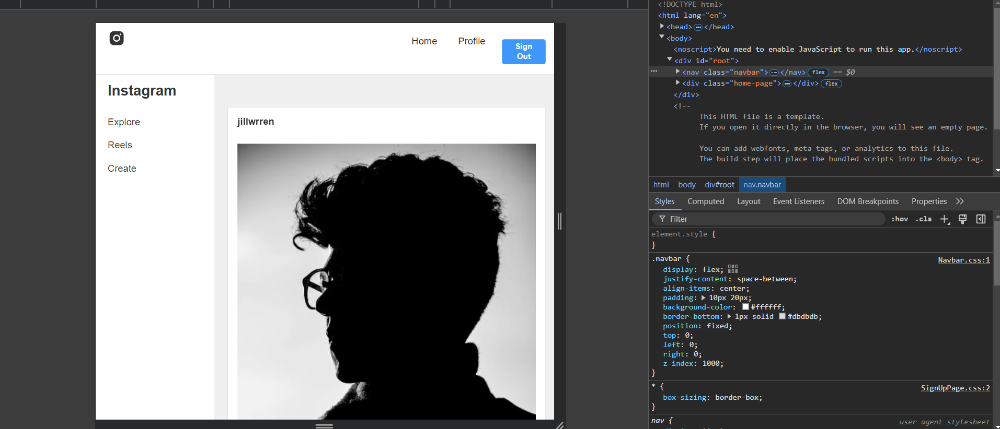

# Instagram Clone Project - README

## Overview

This project is a simplified clone of Instagram, implementing basic features such as user registration, login, creating and managing posts, and user interactions like following other users, commenting, and liking posts. The project is built with a Spring Boot backend with MVC architecture and a React frontend.

## Project Structure

Backend: Implemented using Java Spring Boot with MVC architecture.

Frontend: Implemented using React, Javascript, HTML, css.

Database : Dynamo DB

Session Manager : Redis, LocalStorage

Email : Amazon SMS (Simple Mail Service) not in production it is yet in sandbox, as production is a paid version.

## Features

### Backend Features

#### User Registration and Authentication

- Users can register with an email and password.
- Users can verify their registration via OTP.
- Users can sign in and receive a session token.
- Users can sign out, invalidating their session token.
- Users will be assigned their own unique userId

#### User Management

- Get user details by user ID.
- Update user details.
- Delete user account.
- Follow and unfollow other users.
- Add and remove highlights.

#### Post Management

- Create new posts.
- Retrieve a post by ID.
- Update a post.
- Delete a post.
- Comment on posts and remove comments.
- Like and unlike posts.

#### Frontend Features

- User Interface for Registration and Login
- OTP verification screen.
- Home Page shows posts related to users followings
- Explore page shows all the posts
- Create enables users to create a new post

#### Profile Management

- View user profile details.
- Edit profile information.
- View and manage user’s highlights.
- Follow/unfollow other users.
- Private Account / Public Account

#### Post Interaction

- Create new posts with text and images.
- View posts in the feed.
- Comment on posts.
- Like and unlike posts.
- Comments can be deleted by owner of the post or owner of the comment
- Users can view the owner of the post or comment by clicking on the userId

#### Future Capabilities

- Direct Messaging: Implement real-time messaging between users.
- Story Feature: Add a feature for users to upload short-lived stories.
- Notification System: Add a notification system to inform users of new followers, likes, and comments.
- Improved Security: Implement token-based authentication with JWT and refresh tokens.
- Reels Management : Implement Reels using a new Dynamo DB table
- Post / Reels Share option : Implement Post / Reels sharing between users.
- User follow request : Adding User follow request when the account is private

### Setup and Execution

#### Prerequisites

- Java: Make sure you have Java 17 or higher installed.
- Node.js: Install Node.js (version 14 or higher) for the frontend.
- React.js : Setup React JS
- Maven: Install Maven for building the Spring Boot backend.
- Create an AWS account, IAM role and policies to allow access to dynamoDB for the IAM user
- Create security credentials for the IAM user, take note of the access key, secret key, region.
- Add them to Keys.java file
- Setup Amazon Simple Mail Servie and verify emailId's, SMTP username, SMTP password, Email PORT, AWS Host
- Setup wsl if you're on windows and install redis.
- Create dynamoDB tables 'UserDetails', 'PostDetails' and use id to create new indexes for faster searching.

## API Endpoints

### User Endpoints

POST /user/register: Register a new user.

POST /user/verifyOtp: Verify user registration with OTP.

POST /user/signIn: Sign in a user.

POST /user/signOut: Sign out a user.

GET /user/{id}: Get user details by user ID.

PUT /user/{id}: Update user details.

DELETE /user/delete: Delete a user.

GET /user/{user_id}/follow/{follow_id}: Follow a user.

GET /user/{user_id}/unFollow/{follow_id}: Unfollow a user.

POST /user/{id}/addHighlight: Add a highlight to the user's profile.

DELETE /user/{id}/removeHighlight/{index}: Remove a highlight from the user's profile.

### Post Endpoints

POST /post/{userId}: Create a new post.

GET /post/{id}: Get post details by post ID.

PUT /post/{id}: Update post details.

DELETE /post/{id}: Delete a post.

POST /post/{post_id}/comment: Add a comment to a post.

GET /post/{post_id}/unComment/{index}: Remove a comment from a post.

GET /post/{post_id}/like/{user_id}: Like a post.

GET /post/{post_id}/unlike/{user_id}: Unlike a post.

## Screenshots

[Watch the demo video](screenshots/InstaClone%20Recording.mp4)

